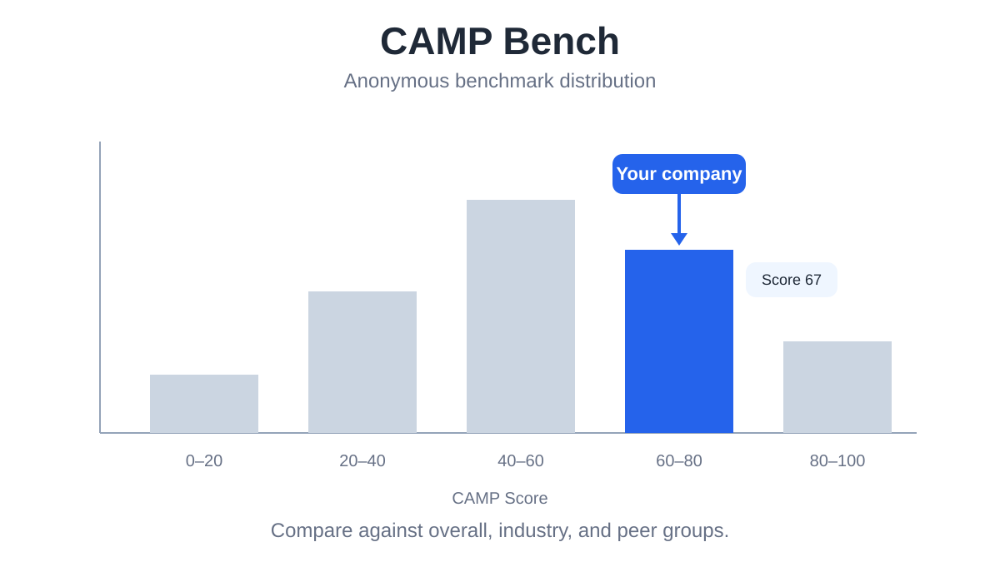

# CAMP

**Company Agent Maturity Profile**

CAMP is a practical, 8–10 minute assessment of how effectively a company or team is using AI—and what it should do next.

It also asks a simple question: **if AI models get better, does your organization get better with them?** CAMP distinguishes merely using AI from becoming **AI-driven**.

## Try CAMP in about 10 minutes

### ChatGPT, Claude, Gemini, or another chat

Paste these two lines:

~~~text
https://github.com/junghoonwoo-stack/CAMP.git
Test my company or team with CAMP.
~~~

That is enough. CAMP will ask one simple question at a time and show your progress.

### Codex

~~~bash
git clone https://github.com/junghoonwoo-stack/CAMP.git
cd CAMP
codex "Test my company or team with CAMP."
~~~

### Claude Code

~~~bash
git clone https://github.com/junghoonwoo-stack/CAMP.git
cd CAMP
claude "Test my company or team with CAMP."
~~~

## What you receive

- Your current **CAMP Stage** and **Score /100**
- Strengths and the biggest bottleneck
- A check on whether your current direction makes sense
- The top three actions for the next 90 days
- Practical projects to start, improve, combine, or stop

You can assess an entire company, a business unit, or one team. No technical background is required.

## What CAMP checks

| Area | Simple question |
|---|---|
| **AI use** | How many people use AI regularly in their work? |
| **Work given to AI** | How much of a real task can AI complete? |
| **Company information and systems** | Can AI use the documents, data, and systems people need? |
| **Reusing knowledge and methods** | Are useful prompts, decisions, and work methods saved and reused? |
| **Roles and ways of working** | Is AI changing who does what and how work moves between teams? |

CAMP separates **Stage** from **Score**. Stage describes how work is currently done with AI. Score shows how evenly the five areas have developed.

## What the conversation looks like

~~~text
CAMP · Progress 1/13  █░░░░░░░░░░░░ 8%
Which company or team are we assessing, and in which country?

CAMP · Progress 2/13  ██░░░░░░░░░░░ 15%
Should your answers describe the whole company, a business unit, or a team?
[A] Whole company  [B] Business unit  [C] Team  [D] New AI-native organization

...

CAMP · Progress 13/13  █████████████ 100%
How consistently is this way of working used?
[A] One-off test  [B] Repeated by several people or teams
[C] Managed with an owner and results  [D] Standard way of working

Your result
Stage 3 — Connected AI
CAMP Score: 60 / 100
Biggest bottleneck: knowledge is not yet being reused across the organization
Next 90 days: three practical priorities

CAMP Bench — optional
Would you like to submit this result privately and receive a comparison report?
[A] Yes  [B] Not now
~~~

Every card shows the current step and progress bar. Questions use everyday language. When the chat supports it, answers appear as clickable choices.

## CAMP Bench — optional comparison

At the end of the assessment, CAMP asks whether you want to join CAMP Bench.

CAMP Bench can show:

- Your percentile and position versus the overall benchmark
- The score distribution and median
- Your five-area strengths and gaps
- Industry comparison when at least 10 anonymous organizations are available

CAMP Bench is still early, so comparison data is limited today and will become more useful as participation grows.

### Submission

If you choose to participate, CAMP shows what will be sent and asks for consent.

- **Local agent:** submits directly from your computer.
- **Hosted chat:** if direct submission is unavailable, upload the JSON file to the [CAMP Bench submission page](https://camp-bench-receiver.camp-bench-jhw.workers.dev/submit?lang=en).

No GitHub account is needed. A **CB-** receipt confirms success. Other organizations remain anonymous, and personal names, email addresses, and raw internal documents are excluded.

Methodology and documentation

- [Stages and Agent definition](references/STAGES.md)
- [Assessment playbook and evidence rules](references/PLAYBOOK.md)
- [Participant-facing question guide](references/QUESTION_GUIDE.md)
- [Report format](references/REPORT_TEMPLATE.md)
- [CAMP Bench methodology](references/BENCHMARK.md)
- [CAMP Bench submission](references/SUBMISSION.md)

## License

CAMP framework and documentation use **CC BY 4.0**. If you redistribute or publish the framework or an adapted version, retain a link to the canonical project.

---

# CAMP

CAMP는 우리 회사나 팀이 **AI를 실제 업무에 얼마나 잘 활용하고 있는지, 다음에는 무엇을 해야 하는지** 약 8–10분 안에 점검하는 진단입니다.

그리고 한 가지를 더 봅니다. **AI Model이 좋아질수록 우리 조직도 같이 좋아지는가?** 단순히 AI를 활용하는 것과 **AI로 구동되는 것**을 구분합니다.

## 가장 쉽게 시작하기

### ChatGPT, Claude, Gemini 등 대화형 AI

아래 두 줄만 붙여 넣으세요.

~~~text
https://github.com/junghoonwoo-stack/CAMP.git
CAMP로 우리 회사나 팀을 테스트해줘.
~~~

이것으로 충분합니다. CAMP가 쉬운 질문을 한 번에 하나씩 하고 진행률을 보여줍니다.

### Codex

~~~bash
git clone https://github.com/junghoonwoo-stack/CAMP.git
cd CAMP
codex "CAMP로 우리 회사나 팀을 테스트해줘."
~~~

### Claude Code

~~~bash
git clone https://github.com/junghoonwoo-stack/CAMP.git
cd CAMP
claude "CAMP로 우리 회사나 팀을 테스트해줘."
~~~

## 무엇을 받을 수 있나

- 현재 **CAMP Stage**와 **100점 기준 점수**
- 잘하고 있는 부분과 가장 큰 병목
- 지금 가는 방향이 적절한지에 대한 점검
- 향후 90일 동안 우선할 세 가지 실행과제
- 시작·개선·통합·중단할 실제 과제

회사 전체, 사업부·본부 또는 한 팀만 진단할 수 있습니다. AI 기술을 몰라도 답할 수 있습니다.

## CAMP가 확인하는 것

| 영역 | 쉽게 말하면 |
|---|---|
| **AI 사용 범위** | 얼마나 많은 사람이 업무에서 AI를 꾸준히 사용하는가? |
| **AI에 맡기는 일** | AI가 실제 업무를 어디까지 해낼 수 있는가? |
| **회사 자료·시스템 연결** | AI가 필요한 문서, 데이터, 사내 시스템을 활용할 수 있는가? |
| **지식과 업무 방법 재사용** | 유용한 프롬프트, 판단, 업무 방법을 저장하고 다시 사용하는가? |
| **역할과 일하는 방식의 변화** | AI로 인해 누가 어떤 일을 하는지, 팀 사이 업무 전달 방식이 바뀌는가? |

CAMP는 **Stage**와 **Score**를 구분합니다. Stage는 현재 AI와 일하는 방식을, Score는 다섯 영역이 얼마나 고르게 발전했는지를 보여줍니다.

## 실제 대화 예시

~~~text
CAMP · 진행 1/13  █░░░░░░░░░░░░ 8%
어느 회사나 팀을 진단할까요? 국가는 어디인가요?

CAMP · 진행 2/13  ██░░░░░░░░░░░ 15%
회사 전체, 사업부·본부, 팀·부서 중 어느 범위를 기준으로 답할까요?
[A] 회사 전체  [B] 사업부·본부  [C] 팀·부서  [D] AI 중심 신설 조직

...

CAMP · 진행 13/13  █████████████ 100%
이런 AI 활용 방식이 실제 업무에서 얼마나 꾸준히 사용되고 있나요?
[A] 일회성 시험  [B] 여러 사람이나 팀이 반복 사용
[C] 담당자와 결과 확인 체계를 두고 운영  [D] 표준 업무방식

진단 결과
Stage 3 — 회사 업무에 연결된 AI
CAMP Score: 60 / 100
가장 큰 병목: 업무 지식과 방법이 아직 조직 전체에서 재사용되지 않음
향후 90일: 우선 실행과제 세 가지

CAMP Bench — 선택 사항
이 결과를 비공개로 제출하고 다른 조직과의 비교 리포트를 받아볼까요?
[A] 예  [B] 지금은 안 함
~~~

모든 카드에 현재 단계와 진행 막대가 표시됩니다. 질문은 일상적인 표현을 사용하며, 대화 환경이 지원하면 선택지가 클릭 버튼으로 나타납니다.

## CAMP Bench — 선택 사항

진단 마지막에 CAMP Bench 참여 여부를 묻습니다.

제출하면 다음을 확인할 수 있습니다.

- 전체 Benchmark 대비 백분위와 현재 위치
- 전체 점수 분포와 중앙값
- 다섯 영역별 강점과 격차
- 같은 업종의 익명 조직이 10개 이상일 때 업종 비교

CAMP Bench는 아직 시작 단계라 비교 표본이 제한적이며, 참여가 쌓일수록 더 유용해집니다.

### 제출

참여를 선택하면 CAMP가 전송할 내용을 보여주고 동의를 받습니다.

- **로컬 Agent:** 사용 중인 컴퓨터에서 바로 제출합니다.
- **대화형 AI:** 직접 제출할 수 없으면 JSON 파일을 [CAMP Bench 제출 페이지](https://camp-bench-receiver.camp-bench-jhw.workers.dev/submit?lang=ko)에 올립니다.

GitHub 계정은 필요 없습니다. **CB-** 접수번호가 나오면 성공입니다. 다른 조직은 익명으로 표시되며 개인 이름·이메일·원문 사내자료는 제출하지 않습니다.

방법론과 상세 문서

- [Stage와 Agent 정의](references/STAGES.md)
- [진단 Playbook과 근거 기준](references/PLAYBOOK.md)
- [참여자용 질문 가이드](references/QUESTION_GUIDE.md)
- [Report 형식](references/REPORT_TEMPLATE.md)
- [CAMP Bench 기준](references/BENCHMARK.md)
- [CAMP Bench 제출 안내](references/SUBMISSION.md)

## License

CAMP Framework와 문서는 **CC BY 4.0**입니다. Framework 또는 수정본을 외부에 재배포·공개할 때 canonical project 링크를 유지합니다.
